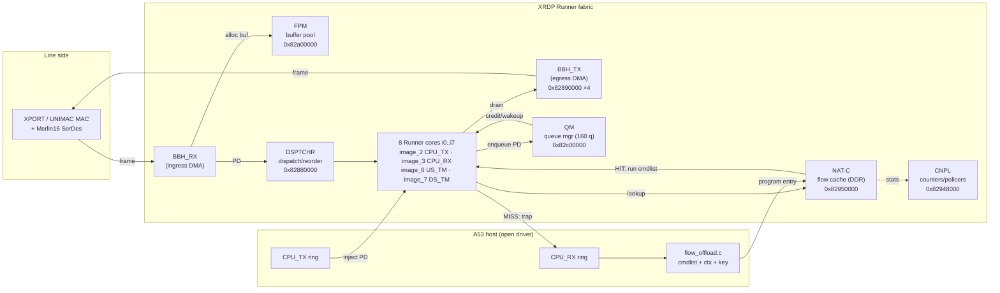
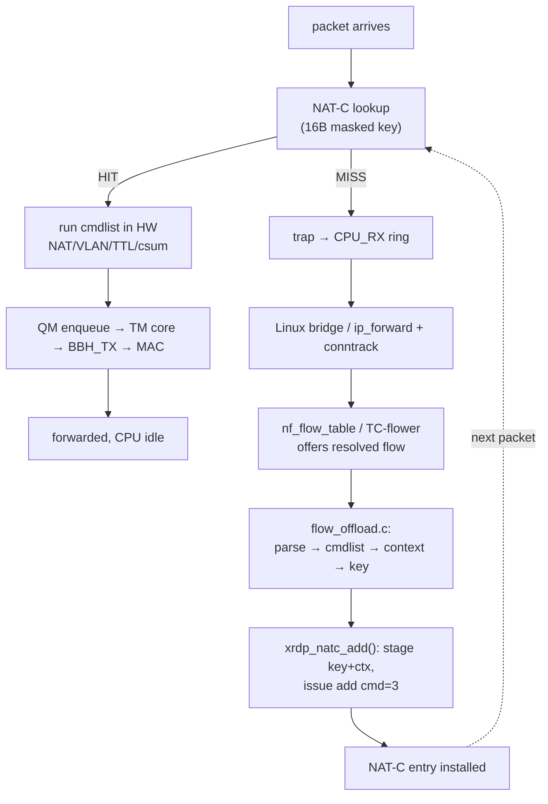

# 09 — Hardware acceleration on the BCM4916/BCM6813 XRDP "Runner" datapath

**The payoff doc.** This is the end-to-end explanation of how packet acceleration
works on the ASUS GT-BE98 (BCM4916 host SoC, BCM6813 XRDP silicon), and of how the
open driver in `driver/runner/*` drives it. It is written so a competent driver
author can (a) understand the accelerated path and (b) reimplement the control
plane. It synthesises the four subsystem audits (02 flow-offload, 03 cmdlist,
04 pcs-serdes, 06 stock-oracle) and the primary RE notes
(`re-notes/xrdp-offload-abi.md`, `re-notes/rdpa-offload-controlplane.md`,
`re-notes/realhw/11-route-a-egress-spec.md`).

Every register base is quoted relative to the rdpa MMIO window at physical
`0x82000000` unless an absolute address is given. `file:line` citations are to
the committed tree at audit time.

> **One-paragraph model.** A packet is DMA'd off the MAC into a DDR buffer by
> hardware, classified by 8 microcoded Runner cores, and looked up in **NAT-C**, a
> DDR-backed connection cache keyed by a 16-byte masked big-endian key. On a
> **HIT**, the Runner executes the flow's **cmdlist** (a per-flow XPE byte-code
> micro-program that does NAT/VLAN/TTL/checksum edits in place), enqueues the
> packet into the **QM** (queue manager), from where a **TM** Runner core drains it
> to **BBH_TX** and out the egress MAC — the A53 CPU is never touched. On a
> **MISS**, the first packet traps to the CPU, Linux conntrack/flowtable resolves
> it, and the open driver compiles a cmdlist + context + key and installs a NAT-C
> entry so every subsequent packet of that flow is a HIT. The host driver owns
> everything *up to* the NAT-C entry; the proprietary Runner microcode owns
> everything that runs *from* it.

---

## 1. The XRDP / Runner architecture

XRDP (the "Broadcom Runner" datapath) is **not** a bcm4908-style direct-DMA
Ethernet MAC. There is no host-visible descriptor ring that maps 1:1 to a MAC.
Instead a cluster of microcoded processors ("Runner cores") plus a set of
fixed-function accelerator blocks move, classify, transform and queue every
packet; the host CPU is one more "port" (the CPU_RX/CPU_TX rings) hanging off that
fabric. This is why even plain CPU forwarding requires driving the Runner, and why
acceleration is not an add-on but the native mode of the chip.

### 1.1 The blocks

| Block | Base (rel. `0x82000000`) | Absolute | Role |
|---|---|---|---|
| **Runner cores** (`i0..i7`) | per-core SRAM + ctl regs | — | 8 microcoded processors; each runs one *image* (thread set). Classify, look up, run cmdlists, drain queues. `XRDP_RNR_CORES = 8` (`bcm4916_runner.h:48`) |
| **PSRAM** | `0x00000000` | `0x82000000` | on-chip SRAM: Runner tables, ring descriptor tables, NAT-C indirect staging (`bcm4916_runner.h:41`) |
| **DSPTCHR** (dispatcher/reorder) | `0x00880000` | `0x82880000` | ingress dispatcher + egress reorder; hands packet descriptors (PDs) between blocks and Runner tasks via VIQs (virtual ingress queues) (`bcm4916_runner.h:61`) |
| **BBH_RX / BBH_TX** | TX `0x00890000` (stride `0x2000`, ×4) | `0x82890000` | "Buffer/Burst Handler": the DMA engines between a MAC and DDR. BBH_RX DMAs ingress frames into FPM buffers; BBH_TX drains queued PDs to the egress MAC (`bcm4916_runner.h:68-69`) |
| **FPM** (free-pool manager) | `0x00a00000` | `0x82a00000` | allocates/frees the fixed-size DDR packet buffers (tokens) that carry frames through the fabric (`bcm4916_runner.h:71`) |
| **QM** (queue manager) | `0x00c00000` | `0x82c00000` | the central egress queue aggregator (up to 160 queues). Holds PDs, applies WRED, and issues credit/wakeups to the TM Runner cores that drain each queue (`bcm4916_runner.h:72,81`) |
| **NAT-C** (NAT/connection cache) | `0x00950000` | `0x82950000` | the **primary 5-tuple/L2 flow cache**, in DDR. Entry = 16-byte masked key + `FC_UCAST_FLOW_CONTEXT_ENTRY` result. HIT/MISS here is the fast-path/slow-path decision (`flow_offload.h:46`) |
| **HASH/CAM** | — | `0x82920000` | separate CAM+context-RAM lookup for multicast/IPTV/aux keys. Not the unicast path (`re-notes/xrdp-offload-abi.md` §3.1) |
| **CNPL** (counter & policer) | — | `0x82948000` | token-bucket policers + per-flow stat counters (`flow_hits`/`flow_bytes`), indexed by the context's `policer_id` (`re-notes/xrdp-offload-abi.md` §3.2) |
| **XPORT MAC + MPCS + Merlin16 SerDes** | MAC `0x837f0000`, MPCS `0x828c4000`, SerDes `0x837ff500` | absolute | the 10G line side (eth0/1/3). Owned by `pcs-bcm-xport.c` + `bcm_sf2`, not the Runner (`04-pcs-serdes.md` §2.1) |

### 1.2 The Runner cores and their images

The 8 cores each load a **microcode image** that defines the threads (tasks) that
core runs. The core↔image identities the open driver depends on
(`bcm4916_runner.h:52,160-161`; `re-notes/realhw/11` §D/E, live-confirmed):

| Core | Image | Role |
|---|---|---|
| core 0 | image_0 | CFE2 / direct-BBH path (present only in the bootloader image) |
| core 2 | image_2 | **CPU_TX** (host→fabric); TX threads 6/7 (`RNR_CPU_TX_THREAD = 6`) |
| core 3 | image_3 | **CPU_RX** (fabric→host); RX thread 1 (`RNR_CPU_RX_THREAD = 1`) |
| core 6 | image_6 | **US_TM** (upstream traffic manager: drains QM queues to BBH_TX) |
| core 7 | image_7 | **DS_TM** (downstream traffic manager) |

The microcode is a proprietary, non-redistributable blob (`RUNNER_FW_NAME =
"brcm/bcm4916-runner-microcode.bin"`, `bcm4916_runner.c:101`). It is the
*interpreter* of the cmdlist byte-code and the executor of the classify/lookup
pipeline; §4 draws the exact open/closed line.

### 1.3 Block topology



---

## 2. The accelerated packet path

### 2.1 Fast path (NAT-C HIT) — CPU idle

Trace of an already-offloaded packet (e.g. the 2nd..Nth packet of a NAT'd TCP
connection):

1. **MAC ingress.** The XPORT/UNIMAC MAC receives the frame off the wire.
2. **BBH_RX + FPM.** BBH_RX allocates a DDR buffer from FPM (a *token* →
   `pool_vbase + index*chunk_size`, `bcm4916_runner.c:252-268`) and DMAs the frame
   into it. It emits a packet descriptor (PD) referencing the FPM buffer.
3. **DSPTCHR → Runner core.** The dispatcher schedules the PD onto a classifier
   thread on one of the Runner cores.
4. **Parse + key build.** The microcode parses L2/L3/L4 headers and composes the
   **16-byte NAT-C key** — for a routed flow the *original* (pre-NAT) 5-tuple, big
   endian, AND-masked with the per-table key mask (§3.4).
5. **NAT-C lookup.** The Runner presents the masked key to the NAT-C engine, which
   hashes it (HW-internal polynomial) into a DDR bucket/bin and compares.
   - **HIT** → the entry's `FC_UCAST_FLOW_CONTEXT_ENTRY` result is fetched. It
     carries the egress vport/queue and, embedded inline at struct byte +24, the
     flow's **cmdlist**.
6. **cmdlist execution (header rewrite in place).** The Runner walks the cmdlist
   byte-code and applies each op to the frame in the FPM buffer (§3.5 for the op
   set). For a NAT'd IPv4 flow, in order: decrement TTL → replace IP SA/DA →
   IP-header incremental checksum → replace L4 sport/dport → L4 incremental
   checksum. VLAN push/pop/mangle for bridged flows. This is `xrdp_build_nat_cmdlist`
   / `xrdp_build_l2_cmdlist` output (`flow_offload.c:72,120`).
7. **QM enqueue.** The Runner enqueues the (now-rewritten) PD into the QM queue
   named by the context (`service_queue_id` / vport tx-flow resolution).
8. **TM core drain.** QM, once its queue is non-empty and bound to a RUNNER_GRP,
   issues a credit/wakeup over the UPDATE_FIFO to the bound **TM** Runner core
   (US_TM/DS_TM), which pops the PD from the queue.
9. **BBH_TX + MAC egress.** The TM core hands the PD to the BBH_TX instance whose
   `QMQ` bit marks it QM-fed; BBH_TX DMAs the frame out of the FPM buffer to the
   egress MAC, then auto-frees the buffer back to FPM.

The A53 sees nothing. That is how the device sustains 10G forwarding without CPU
load.

### 2.2 Slow path (NAT-C MISS) → learn → program

The first packet of a flow:

1. Steps 1–5 as above, but NAT-C **MISS** (no entry).
2. **Trap to CPU.** The microcode traps the frame to the CPU_RX ring (with a
   `cpu_reason`); the open driver's NAPI poller delivers it to the Linux stack.
3. **Linux resolves it.** The bridge / `ip_forward` + conntrack path forwards the
   packet normally and, once the connection is established and offloadable, the
   **netfilter flowtable** (or TC-flower) offers the resolved flow — 5-tuple + NAT
   mangle + VLAN/dec-ttl action list — to the driver.
4. **Compile + install (this is `flow_offload.c`).** The driver parses the flow,
   compiles a cmdlist, builds the context/result, builds the masked key, and calls
   `xrdp_natc_add()` to program a NAT-C entry (§3).
5. **Subsequent packets HIT.** Every following packet of that 5-tuple takes the
   fast path §2.1 and never touches the A53.



The critical design fact: **the fast/slow decision is made in hardware (NAT-C
HIT/MISS)**. The open driver never decides per-packet; it only *populates* the
table. This is exactly the mainline netfilter-flowtable HW-offload contract, and
`flow_offload.c` is modelled line-for-line on `mtk_ppe_offload.c` (the only
mainline HW-NAT precedent).

---

## 3. The control plane — how a flow is installed

This is the heart of the reimplementation. Entry point is `xrdp_flow_replace`
(`flow_offload.c:497`), driven either by a real `FLOW_CLS_REPLACE` via
`ndo_setup_tc → xrdp_offload_setup_tc` (`flow_offload.c:671`) or by the debugfs
self-tests (`xrdp_offload_selftest` / `_nat_selftest`, `:707/:774`). The pipeline:

```
flow_cls_offload
  │  xrdp_parse_flow()            -> struct xrdp_flow   (flat tuple + actions)  flow_offload.c:373
  ▼
struct xrdp_flow
  │  is_routed ? xrdp_build_nat_cmdlist() : xrdp_build_l2_cmdlist()  -> struct xpe_cmdlist   :72 / :120
  │  xrdp_build_ctx()             -> struct fc_ucast_ctx (cmdlist embedded @ +24)  :158
  │  xrdp_build_key()             -> struct natc_key     (16B masked BE)          :243
  ▼
  xrdp_natc_add(o, key, ctx, &idx)   [conduit: PSRAM staging + indirect add]  bcm4916_runner.c:660
  │
  rhashtable_insert_fast(cookie -> {natc_idx, key})
```

### 3.1 Parse — `xrdp_parse_flow` (`flow_offload.c:373`)

Dispatches by `FLOW_DISSECTOR_KEY_CONTROL` addr_type:

- `addr_type == FLOW_DISSECTOR_KEY_IPV4_ADDRS` → **routed L3/NAT** (`is_routed=1`):
  reads `KEY_BASIC` (ip_proto, TCP/UDP only), `KEY_IPV4_ADDRS` (original ip_sa/da),
  `KEY_PORTS` (original l4 sport/dport); action loop maps `FLOW_ACTION_MANGLE` →
  NAT rewrite fields (`xrdp_parse_mangle`, `:309`), `CSUM` → `is_hw_cso`.
- `addr_type == 0` → **L2 bridge** (`is_routed=0`): reads `KEY_ETH_ADDRS`,
  optional `KEY_VLAN`; action loop maps `VLAN_PUSH/POP/MANGLE`.

Output is the flat `struct xrdp_flow` (`flow_offload.h:138-181`) consumed by all
three builders.

### 3.2 cmdlist — `xrdp_build_{l2,nat}_cmdlist` + `cmdlist.c`

The cmdlist is a per-flow micro-program: a length-delimited stream of 32-bit
big-endian command words (each two 16-bit BE half-words), some carrying an inline
immediate. Op ordering is decided by the two builders; byte encoding by
`cmdlist.c`.

**L2 (`xrdp_build_l2_cmdlist`, `flow_offload.c:72`):** plain forward emits a
**0-byte body** (the forwarding decision is in the context, not the cmdlist);
VLAN push = `insert_16(12,4)` + `replace_32(12, tag)`; pop = `delete_16(12,4)`;
mangle = `replace_bits_16(14, 0, 12, vid)`.

**NAT (`xrdp_build_nat_cmdlist`, `flow_offload.c:120`)** in the exact RE'd
`addIpv4Commands` order:
`decrement_8(TTL@22)` → `replace_32(SA@26)`/`replace_32(DA@30)` →
`apply_icsum_16(IP csum@24)` → `replace_16(sport@34)`/`replace_16(dport@36)` →
`apply_icsum_16(L4 csum@40|50)`. The IP and L4 checksum fixups are each coalesced
to one (incremental ones-complement checksum is commutative over the deltas); the
L4 fixup must follow *all* replaces because the L4 pseudo-header covers the IP
addrs. The per-op byte layout, pinned from the stock `xpe_api.armb53_6813.o`
disassembly:

| emitter | byte0 | opcode (byte0>>2) | byte1 | byte2/3 + inline |
|---|---|---|---|---|
| `xpe_cmd_replace_bits_16` | `0x50` | `0x14` | `(off>>1)+1` | `0x94` / pos·width nibble; +2B `data<<pos` |
| `xpe_cmd_move_packet` (ins/del) | `0x4c` | `0x13` | `from` (raw) | `to` (raw) / `nbytes` |
| `xpe_cmd_replace_32` | `0x60` | `0x18` | `(off>>1)+1` | `0x94` / `0x04`; +4B imm |
| `xpe_cmd_replace_16` | `0x60` | `0x18` | `(off>>1)+1` | `0x94` / `0x02`; +2B imm |
| `xpe_cmd_decrement_8` | `0x6a` | `0x1a` (ADD-1) | `(off>>1)+1` | `(off>>1)+1` / `0xff` |
| `xpe_cmd_apply_icsum_16` | `0x70` | `0x1c` | `(off>>1)+1` | inline low half = 0 |

`byte0 = opcode<<2` and `byte1 = (byte_offset>>1)+1` are pinned and (for `0x60`
REPLACE) live-confirmed against the captured word `0x6014eb98`. The list is
finalised by `xpe_cmd_end` (`cmdlist.c:207`): **no NOP terminator**, executable
length recorded in `data_len`, trailing slot slack padded with the byte `0xfc`
(never decoded). See `03-cmdlist.md` for the full function reference.

### 3.3 Context / result — `xrdp_build_ctx` (`flow_offload.c:158`)

Builds the `FC_UCAST_FLOW_CONTEXT_ENTRY` — the NAT-C "result". Real silicon: a
124-byte packed big-endian bitfield struct with `command_list[100]` at struct
byte **24** and the length in the WORD-1 bitfield `command_list_length_32` (32-bit
word units). The complete XRDP field set (from `rdpa.ko` dump strings) includes
`valid`, `is_routed`, `is_l2_accel`, `is_hw_cso`, `command_list_length_32`,
`vport`, `service_queue_id`, `policer_id`, `tunnel_index_ref`, and the inline
`command_list[]` (`re-notes/xrdp-offload-abi.md` §1.3).

The open driver builds a **flat-byte contract** version (`struct fc_ucast_ctx`,
`flow_offload.h:100`) that the QEMU model decodes identically:

| field | offset | note |
|---|---|---|
| flags | `CTX_OFF_FLAGS = 8` | `IS_ROUTED` bit5, `IS_L2_ACCEL` bit4, `IS_NAT` bit3 |
| egress vport | `CTX_OFF_VPORT = 12` | |
| service_queue_id | `CTX_OFF_SERVICE_Q = 13` | |
| is_hw_cso | `CTX_OFF_IS_HW_CSO = 14` bit0 | |
| **cmdlist body** | `XPE_CTX_CMDLIST_OFF = 24` | **pinned to real silicon** (was 16 in the RDP-impl2 template) |
| cmdlist dlen / len / valid | 104 / 105 / 106 | **contract** byte counts; real HW uses `command_list_length_32` word count |

Only offset 24 (and total size 124) is silicon-pinned; every other `CTX_OFF_*` is a
driver↔model contract that a real-HW builder must replace with the true GPL
bitfield packing (`flow_offload.h:82-119`).

### 3.4 Key — `xrdp_build_key` (`flow_offload.c:243`)

A 16-byte key = 4×`__be32`, two classes by `is_routed`:

- **L3 (routed)** — original 5-tuple, byte layout pinned from a live stock capture:
  `w0 = ip_sa`, `w1 = ip_da`, `w2 = sport<<16 | dport`,
  `w3 = ToS<<24 | 0x28<<16 | (dir|pure_ack)<<8 | 0x68`. The class byte `0x28` and
  trailer `0x68` are hardcoded live-observed constants for the eth0 upstream-TCP
  table (`flow_offload.c:239-261`).
- **L2 (bridge)** — `w0/w1/w2` = MAC DA+SA, `w3 = ethertype<<16 |
  ingress_vport<<4 | (vlan present)`.

All four words `cpu_to_be32`'d. On real silicon the stock add path additionally
AND-masks the key with a per-table mask (`key[i] &= ~rev32(mask[i])`,
`re-notes/xrdp-offload-abi.md` §1.1); the open driver applies no mask here (see
§6).

### 3.5 The NAT-C add — `xrdp_natc_add` (`bcm4916_runner.c:660`)

`flow_offload.c` never touches MMIO; the conduit driver owns the window. The open
analog of the stock `drv_natc_key_result_entry_var_size_ctx_add` (mask → key_idx_get
→ eng_key_result_write → `eng_command_write(...,3)`) stages into PSRAM and issues an
indirect add:

```c
memcpy_toio(xrdp + XRDP_OFF_PSRAM + NATC_STAGE_KEY /*0x0100*/, key, 16);      // 1. key
memcpy_toio(xrdp + XRDP_OFF_PSRAM + NATC_STAGE_CTX /*0x0120*/, ctx->buf, len);// 2. context
writel(idx,          xrdp + XRDP_OFF_PSRAM + NATC_INDIR_INDEX /*0x0200*/);    // 3. slot
dma_wmb();
writel(NATC_CMD_ADD, xrdp + XRDP_OFF_PSRAM + NATC_INDIR_CMD   /*0x0204*/);    // 4. add=3 (doorbell)
```

`NATC_CMD_ADD = 3` matches the stock `drv_natc_eng_command_write(...,3)`. The
staging offsets are **contract placeholders** — the real `ag_drv_natc_indir_*`
interface differs (§6). The driver then tracks the entry in an rhashtable keyed by
the flowtable cookie (`xrdp_flow_entry`, `flow_offload.c:289`) so DESTROY/STATS can
find it; DESTROY re-issues the masked key to `xrdp_natc_del` (`:686`), STATS is a
stub (CNPL read not wired, `:697`).

---

## 4. Runner MICROCODE vs the open host driver — the exact line

This is the single most important boundary to internalise.

```
        HOST (open, GPL, this repo)          │        RUNNER MICROCODE (proprietary blob)
 ───────────────────────────────────────────┼──────────────────────────────────────────────
 flow learning: nf_flow_table / TC-flower    │  packet parse + header field extraction
 parse resolved flow -> struct xrdp_flow     │  NAT-C key hash + bucket/bin lookup (HIT/MISS)
 compile cmdlist byte-code (cmdlist.c)        │  cmdlist INTERPRETER: executes the byte-code
 build FC_UCAST context/result               │  in-place NAT/VLAN/TTL/csum edits on the frame
 build 16B masked key                        │  QM enqueue, WRED, credit/wakeup to TM cores
 stage key+ctx, issue NAT-C add (cmd=3)       │  TM core drain -> BBH_TX DMA -> MAC egress
 CPU_RX NAPI (slow path) / CPU_TX inject      │  FPM alloc/free, DSPTCHR scheduling
 QM/BBH/DSPTCHR/FPM register bring-up         │  the actual per-packet datapath execution
```

**What the microcode does that the host cannot, and why it is mandatory.** The
per-packet datapath — classify, NAT-C hash/lookup, cmdlist *interpretation*, the
in-place edits, QM/TM/BBH movement — all runs inside the 8 Runner cores executing
the shipped microcode. There is **no HW bypass**: the host cannot present a frame
to BBH_TX directly on this generation (`XRDP_BBH_PER_LAN_PORT` is not defined;
the direct-BBH `BBH_TX_RING_TABLE`/`BB_DESTINATION` model exists only in the CFE2
`image_0`, which the runtime `image_2` lacks — `re-notes/realhw/11` §"Why this is
needed"). Even a CPU-injected TX frame must be handed to the microcode's CPU_TX
thread, which routes it through the QM/TM cores to reach BBH_TX. So the microcode
is required for *any* packet movement, accelerated or not.

**What the host is responsible for.** Everything that decides *what the microcode
should do* for a given flow: producing the cmdlist byte-code, the context/result,
and the masked key, and installing them via the NAT-C add ABI; plus the one-time
bring-up of the fabric blocks (QM/BBH/DSPTCHR/FPM/rings) and the slow-path
CPU_RX/CPU_TX rings.

**Firmware status.** The Runner microcode is 256 KB inside the closed `rdpa.ko`,
`license=Proprietary`, taint P, and absent from the 4916 GPL SDK
(`re-notes/rdpa-offload-controlplane.md`; memory `runner-firmware-gpl-shippable`).
A fully-open+shippable datapath is therefore impossible today: the realistic model
is *open host driver + microcode the user extracts from their own `rdpa.ko`*, loaded
via `request_firmware` (`RUNNER_FW_NAME`, `bcm4916_runner.c:101`; skipped in
emulation via `runner_emulated` / `brcm,runner-emulated`, `:660-...`). The 10G
SerDes has a parallel proprietary boundary — its ~31 KB Merlin16-Shortfin PMD
microcode (`04-pcs-serdes.md` §H1) — with the same open-driver-around-a-blob shape.

The important reframing (memory `wifi-style-strategy`): the microcode is a blob
like a Wi-Fi dongle firmware, **not** a wall. The closed control plane
(`bcm_enet`/`rdpa`/`pktrunner`/`cmdlist`) is the *oracle* being reverse-engineered;
the deliverable is the open host side driving the stock microcode for full
features.

---

## 5. Route A as a worked example

"Route A" is a concrete, fully-worked instance of driving the Runner from the open
driver: making a **CPU-injected** frame egress a LAN port. It is the slow-path TX
counterpart of the offload work and exercises exactly the QM→TM→BBH_TX egress the
fast path also uses. It matters because it is the piece that was empirically pinned
against live silicon, so it shows the full loop: RE spec → coded register sequence
→ module params → live-oracle confirmation.

**The problem.** The runtime `image_2` CPU_TX thread (core 2, thread 6) does **not**
push directly to BBH_TX. It hands PDs to the egress dispatcher → a **TM/QM Runner
core** (image_6 US_TM / image_7 DS_TM) which drains a QM queue into BBH_TX. So an
open slow-path TX with the stock blob **must** bring up QM + a TM-core egress queue.
The symptom of not doing so was "`read_idx` freezes at 3, `sync_fifo` stays 0"
(`re-notes/realhw/11` §"Why this is needed").

**The open driver's three moves** (opt-in via `route_a=1`; the silicon-specific
values are module params, `bcm4916_runner.c:158-182`):

1. **QM bring-up — `runner_qm_init` (`bcm4916_runner.c:1053`).** The load-bearing
   step is the gen-2 QM SRAM auto-init: write `MEM_AUTO_INIT@0x138` EN bit0, poll
   `MEM_AUTO_INIT_STS@0x13c` DONE bit0. Without it, enabling `fpm_prefetch` makes
   QM read dirty SRAM and hang the SoC (the historical `0x307` hang). Then program
   `FPM_BASE_ADDR@0x034` = `pool_pbase>>8`, `DDR_SOP_OFFSET@0x03c = 18`, bind one
   RUNNER_GRP (`QUEUE_CONFIG@grp+0x04` = [queue,queue], `RNR_CONFIG@grp+0x00` =
   `bb_id | task<<8 | EN(bit16)`), and finally `QM_ENABLE_CTRL@0x000 = 0x307`.
2. **BBH_TX binding — `runner_bbh_tx_route_a` (`bcm4916_runner.c:1100`).** Point the
   LAN BBH_TX instance at the QM aggregator: `BBCFG_2@0x08` = feeding TM-core bb_id,
   `RNRCFG_2_0@0x60` TASK = TM egress thread, and the switch that flips it from
   runner-fed to QM-fed — `QMQ_LAN@0x4b0` = 1 and `QMQ_UNIFIED@0x7b0` = 1.
3. **TX descriptor — `runner_start_xmit` (`bcm4916_runner.c:560`).** Set
   `word0.is_egress` (bit31) and, when route_a is up, `first_level_q` (bits[30:22]) =
   `route_a_queue`, so the TM core enqueues the PD to the QM queue bound to BBH_TX.
   `word2` sets `is_emac` (bit28) and the egress port (bits[26:20] =
   `RUNNER_FIRST_PORT`); `word3` carries the FPM buffer number. Then the doorbell:
   bump `CPU_TX_RING_INDICES` write_idx and issue a per-frame `CFG_CPU_WAKEUP` to
   core2/thread6 (`tx_ring_doorbell`, `:534`).

**Live oracle confirmation** (`re-notes/realhw/11` §"LIVE ORACLE RESULTS", captured
read-only on the stock (fallback) slot via `tools/stock-watch`): `QM_ENABLE_CTRL = 0x0307`
(confirms the value), `MEM_AUTO_INIT_STS = 0x01` (confirms the auto-init poll is
real and done-bit0), the RUNNER_GRP map (grp1 q0–79→core6 US_TM task4; grp0
q80–111→core7 DS_TM task3), and `BBH_TX[1]` is the only QM-fed instance
(`QMQ@0x7b0 = 0x01`) → `route_a_bbh_inst = 1`. This is the template for how *every*
`★SILICON` unknown gets pinned: code the verified-offset structure, expose the
unknowns as module params defaulted to gen-1/CFE values, and pin them by a
read-only devmem/kprobe oracle before the first live egress test.

**Still open for Route A:** the logical→physical queue map (`route_a_queue`): the
oracle saw `info.queue_id = 0` for CPU→LAN frames, but that is a port-relative
logical queue, not necessarily physical QM queue 0. Two candidate sets (B:
queue≈80/grp0/DS_TM, A: queue0/grp1/US_TM) are to be tried empirically via the
params.

---

## 6. What is proven vs assumed

### Proven — silicon / oracle-confirmed

- **Architecture.** NAT-C is the primary unicast flow cache in DDR; its result *is*
  the `FC_UCAST_FLOW_CONTEXT_ENTRY`, which embeds the cmdlist. Add path RE'd from
  `rdpa.ko drv_natc_key_result_entry_var_size_ctx_add`: mask → key_idx_get →
  eng_key_result_write → `eng_command_write(cmd=3)` (`re-notes/xrdp-offload-abi.md`
  §1.1). `[XRDP-BIN]`
- **Context.** cmdlist body sits at `FC_UCAST` struct byte **+24**, total entry
  **124 bytes** — pinned byte-for-byte by the read-only `natc_dump.ko` capture of a
  live stock NAT-C entry (`06-stock-re-oracle.md` §2.5; `flow_offload.h:82-98`).
- **L3 key `w3` layout.** `ToS<<24 | 0x28<<16 | flags<<8 | 0x68`, corrected from an
  earlier `proto<<24` guess by the live capture (`flow_offload.c:232-236`).
- **cmdlist encoding.** `opcode = byte0>>2`, `byte1 = (off>>1)+1`; byte0 values
  `0x50/0x4c/0x60/0x6a/0x70` pinned from the `xpe_api.armb53_6813.o` disasm, and
  `0x60`/REPLACE live-confirmed by the captured word `0x6014eb98`. List is
  length-delimited (no NOP terminator), trailing slot padded with `0xfc`
  (`re-notes/xrdp-offload-abi.md` §2.5, UNKNOWN #3 resolved).
- **Route A.** `QM_ENABLE_CTRL = 0x0307`, `MEM_AUTO_INIT_STS = 0x01`, the RUNNER_GRP
  queue→TM-core map, and `BBH_TX[1]` as the QM-fed LAN instance — all read live on
  the stock (fallback) slot. `rdpa_cpu_send_pbuf` arg order `(pbuf, info)` live-confirmed
  (`re-notes/realhw/11` LIVE ORACLE RESULTS; commit `9b6c264`).

### Assumed — RE'd but NOT silicon-validated

- **Full `FC_UCAST` bitfield offsets.** Only cmdlist@24 and size 124 are pinned;
  every other `CTX_OFF_*` (flags@8, vport@12, service_q@13, cso@14, the length/valid
  bytes) is a driver↔QEMU-model **contract**, not the real 6813 packed bitfield.
  A real-HW context builder must emit the GPL bitfield struct with
  `command_list_length_32` in 32-bit-word units (`flow_offload.c:190-201`; ABI
  UNKNOWN #1).
- **NAT-C indirect-add register interface.** `NATC_STAGE_KEY 0x0100 /
  NATC_STAGE_CTX 0x0120 / NATC_INDIR_INDEX 0x0200 / NATC_INDIR_CMD 0x0204` are
  contract placeholders; the real `ag_drv_natc_indir_addr/data` sequence, HW
  slot/hash selection (`drv_natc_key_idx_get`), and whether a delete opcode exists
  (`NATC_CMD_DEL = 4` is an open invention) must be RE'd (`flow_offload.h:56-62`;
  ABI UNKNOWN #4).
- **Key composition / mask / table-id mapping.** No per-table key mask is applied;
  the L3 key omits `ip_proto` (class byte hardcoded `0x28`) and `ingress_vport`
  (byte 15 hardcoded `0x68`); the L2 key encodes only a VLAN-presence bit and a
  hardcoded ethertype. The real `nat_cache_key0` / `natc_l2_vlan_key` masks and the
  table-id↔direction map are unverified (`flow_offload.c` findings F4/F5/F9/F19; ABI
  UNKNOWN #5).
- **cmdlist operand sub-packing + relocation.** `byte0=opcode<<2` and byte1 are
  pinned, but everything below (byte2 `0x94` `.data` reference, the
  inline-vs-relocated split, `replace_16`/`_32` disambiguation by `byte3==4`, the
  `replace_bits` pos/width nibble) is the open driver's own packing, matched only to
  its QEMU model. Critically, `xpe_cmd_end` does **not** relocate the `.text` `.data`
  "from" offsets or concatenate a `.data` region — on real silicon the `0x94` byte2
  would be read as a `.data` offset, so the emitted buffers will not run unmodified
  (`03-cmdlist.md` findings #1/#2; ABI UNKNOWN #3 lower half).
- **cmdlist byte-for-byte for the emitted programs.** The only live-captured cmdlist
  body was a GDX-local-delivery program the open driver does not emit; no L2-accel or
  routed-NAT cmdlist was ever captured, so the VLAN/NAT programs are validated
  structurally (encoding/framing) but not byte-for-byte (`03-cmdlist.md` finding #3).
- **UDP checksum.** Uses `apply_icsum_16`, not the stock skip-if-zero
  `apply_icsum_nz_16` (unimplemented) — a checksum-0 UDP datagram would get a
  spurious checksum (`flow_offload.c` finding F1).
- **Stale QEMU proofs.** The current per-op cmdlist encoding and L3 key layout no
  longer match the byte streams logged in the phase1/phase2 QEMU proof notes; those
  proofs predate the pinned encoding and have not been re-validated against the code
  as it stands (`02-flow-offload.md` findings F12/F13; open question O6).
- **10G SerDes.** The Merlin16-Shortfin PMD microcode load is an unimplemented stub;
  on real HW the 10G ports will not lock without the ~31 KB blob
  (`04-pcs-serdes.md` §H1). Register bases are SDK-oracle-matched, not live-regdump
  confirmed.

### The single hardest unresolved piece

**The clean-room XPE cmdlist compiler — specifically the operand relocation model in
`xpe_cmd_end` and the sub-opcode operand packing below bit 26.** Names, opcodes
(`byte0>>2`), the word-index `byte1`, and the length-delimited framing are pinned;
but the stock emitter lays commands into a `.text` region and operands into a
separate `.data` region, then `xpe_cmd_end` *relocates* the `.text` "from"
references (the `0x94`-relative byte2) and concatenates the two. The open emitter
instead inlines each operand after its command word and does no relocation, so the
byte streams are self-consistent with the QEMU model but would be mis-decoded by
real silicon. Resolving it requires disassembling `xpe_api.armb53_6813.o`'s
`xpe_cmd_*` emitters (or a live read-only capture of a stock L2-accel / routed-NAT
cmdlist) to pin the exact `.text`/`.data` relocation math and operand bit layout.
This is the one gap that stands between the QEMU-proven control plane and a buffer
the real Runner microcode will execute — and it compounds with the still-unpinned
`FC_UCAST` bitfield offsets and NAT-C indirect-register ABI, which must land in the
same generation-consistent pass.

---

*Sources: `docs/audit/{02-flow-offload,03-cmdlist,04-pcs-serdes,06-stock-re-oracle}.md`;
`driver/runner/{flow_offload.c,flow_offload.h,cmdlist.c,cmdlist.h,bcm4916_runner.c,bcm4916_runner.h}`;
`re-notes/{xrdp-offload-abi.md,rdpa-offload-controlplane.md,realhw/11-route-a-egress-spec.md}`.
No device IPs/MACs/credentials or proprietary microcode symbol offsets beyond RE'd
disasm addresses are reproduced.*
