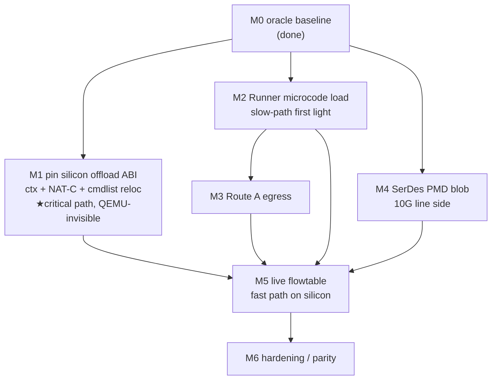

# 10 — Reimplementation guide: from here to full 10G hardware acceleration

**The roadmap doc.** Everything else in `docs/audit/` describes *what the open
driver does today* and *how the stock silicon works*. This doc is the forward
plan: an ordered, testable engineering path from the current tree to a fully
hardware-accelerated 10G datapath on real BCM4916/BCM6813 silicon, with the
proprietary-microcode dependency drawn explicitly at each step.

It builds on and cites the four subsystem audits (`02-flow-offload.md`,
`03-cmdlist.md`, `04-pcs-serdes.md`, `06-stock-re-oracle.md`), the payoff
synthesis (`09-hardware-acceleration.md`), the HW/ABI regmap (`08-hw-abi-regmap.md`),
the QEMU-model audit (`07-qemu-model.md`), and the primary RE notes
(`re-notes/xrdp-offload-abi.md`, `re-notes/rdpa-offload-controlplane.md`,
`re-notes/realhw/11-route-a-egress-spec.md`). All `file:line` citations are to the
committed tree at audit time.

> **The honest one-paragraph status.** The open driver moves real frames
> **both directions between the MAC and the CPU in QEMU** (slow path, tcpdump-proven),
> and *in QEMU* also programs a NAT-C entry that makes the modelled Runner
> forward subsequent packets with full NAT/TTL/csum rewrite, CPU idle. **None of
> the fast path, and none of the egress-through-QM Route A path, has ever run on
> real silicon.** The two hardest remaining pieces are both **clean-room ABI
> gaps that QEMU cannot expose** — the real `FC_UCAST` context bitfield + NAT-C
> indirect-register interface, and the XPE cmdlist `.text`/`.data` relocation
> model — plus two **hard blob dependencies** (the Runner microcode and the
> Merlin16 SerDes PMD image) without which no packet moves and no 10G port locks.

---

## 1. Current state — what works, what is scaffolded, what is missing

Three columns, honestly separated. "Works" means *validated by evidence*;
"scaffolded" means *coded and compiles, contract-proven against the QEMU model
only*; "missing" means *not implemented at all*.

### 1.1 Works — with evidence

| Capability | Evidence | Caveat |
|---|---|---|
| **Slow-path CPU RX** (fabric→host NAPI) and **CPU TX** (host→fabric index-doorbell), a real frame MAC↔CPU both directions | QEMU + tcpdump, memory `open-datapath-driver`; `01-runner-datapath.md` | emulation only; FPM-chunk/MTU + IRQ-name quirks open |
| **DSA control-plane probe** — mainline completes DSA probe + PHY enumeration with real Broadcom IDs against the custom SF2+MDIO QEMU device | memory `qemu-controlplane-harness`; `07-qemu-model.md` | host-side only; no line-side link on real HW without SerDes blob |
| **Flow-offload control plane compiles & self-tests** — parse → cmdlist → context → key → `xrdp_natc_add`, both L2 (Phase 1) and routed-NAT (Phase 2) | `offload-phase2-status.md` §4 (QEMU NAT forward, peer+tcpdump verified rewritten 5-tuple + csums); `02-flow-offload.md` | driven by **debugfs self-test**, never by a live `FLOW_CLS_REPLACE` (`CONFIG_NF_FLOW_TABLE` unset, single-NIC topo) — `offload-phase2-status.md` §6 |
| **Route A oracle pinning** — `QM_ENABLE_CTRL=0x0307`, `MEM_AUTO_INIT_STS=0x01`, RUNNER_GRP queue→TM-core map, `BBH_TX[1]` as the QM-fed LAN instance, `rdpa_cpu_send_pbuf(pbuf, info)` arg order | **read live, read-only, on the stock (fallback) slot** (`re-notes/realhw/11` LIVE ORACLE RESULTS; commit `9b6c264`); `06-stock-re-oracle.md` §2.5 | these are *inputs* pinned; the egress itself is untested |
| **Context cmdlist offset & size** — cmdlist body at `FC_UCAST` struct byte **+24**, total entry **124 B** | live `natc_dump.ko` capture of a real stock NAT-C entry (`06-stock-re-oracle.md` §2.5; `flow_offload.h:82-98`) | only offset-24 and size-124 are pinned; the rest of the struct is not |
| **cmdlist opcode framing** — `opcode=byte0>>2`, `byte1=(off>>1)+1`, length-delimited, `0xfc` pad, no NOP terminator; `0x60`/REPLACE live-confirmed by captured word `0x6014eb98` | `03-cmdlist.md` §2.2; `re-notes/xrdp-offload-abi.md` §2.5 | operand sub-packing below bit 26 is unproven (§1.3) |

### 1.2 Scaffolded — coded, compiles, QEMU-contract-proven only

- **Route A egress** — `runner_qm_init` (`bcm4916_runner.c:1053`),
  `runner_bbh_tx_route_a` (`:1100`), and the QM-fed TX descriptor in
  `runner_start_xmit` (`:560`), opt-in via `route_a=1` with the silicon values as
  module params (`route_a_grp/queue/tm_bb_id/tm_task/bbh_inst`,
  `:158-182`). QEMU-validated end-to-end; **never run on silicon.** The
  logical→physical QM queue (`route_a_queue`) is still un-pinned — two candidate
  sets to try empirically (`re-notes/realhw/11` "Still to resolve").
- **NAT-C add/del conduit** — `xrdp_natc_add` (`bcm4916_runner.c:660`) /
  `xrdp_natc_del` (`:686`): PSRAM staging + indirect `cmd=3` doorbell. The staging
  offsets `NATC_STAGE_KEY 0x0100 / NATC_STAGE_CTX 0x0120 / NATC_INDIR_INDEX 0x0200
  / NATC_INDIR_CMD 0x0204` are **contract placeholders**; `NATC_CMD_DEL=4` is an
  open invention (`flow_offload.h:56-62`; `02-flow-offload.md` F20).
- **`FC_UCAST` context builder** — `xrdp_build_ctx` (`flow_offload.c:158`) writes a
  flat-byte contract layout (`CTX_OFF_*`), not the real 6813 packed bitfield;
  only cmdlist@24 is real (`02-flow-offload.md` F3).
- **NAT-C key builder** — `xrdp_build_key` (`flow_offload.c:243`): L3 `w3` layout
  live-corrected, but no per-table mask, class byte hardcoded `0x28`, trailer
  `0x68`, `ip_proto`/`ingress_vport` omitted (`02-flow-offload.md` F4/F5/F19).
- **XPE cmdlist emitter** — `cmdlist.c`: byte0/byte1 pinned, but no `.text`/`.data`
  relocation and self-invented operand packing (`03-cmdlist.md` findings #1/#2).
- **XPORT PCS bring-up** — `pcs-bcm-xport.c` reset-release + lock-poll around a
  **stub** firmware load (`bcm_xport_pcs_load_firmware`, `:167-175`); QEMU fakes
  lock (`04-pcs-serdes.md` §5 H1).
- **Firmware request path** — `request_firmware(RUNNER_FW_NAME)` at
  `bcm4916_runner.c:722`, bypassed under `runner_emulated` (`:714`); SerDes
  `request_firmware(SERDES_FW_NAME)` at `:1592` (`05-firmware.md`).

### 1.3 Missing — not implemented

- **Live flowtable trigger**: no verified `nf_flow_table`/`TC_SETUP_FT` bind on a
  2-port topology (`02-flow-offload.md` O1/F16).
- **Real `FC_UCAST` bitfield packing** with `command_list_length_32` in word units
  (`02-flow-offload.md` O2).
- **Real NAT-C indirect ABI** (`ag_drv_natc_indir_*`, `drv_natc_key_idx_get`,
  per-table mask) (`02-flow-offload.md` O3/O4).
- **XPE `.text`/`.data` relocation** in `xpe_cmd_end` and the true operand
  sub-packing (`03-cmdlist.md` O1/O3; §6 "the single hardest piece" in
  `09-hardware-acceleration.md`).
- **Runner microcode load on silicon** — the 256 KB proprietary blob
  (`RUNNER_FW_NAME`); without it **no packet moves at all** (`09` §4).
- **Merlin16-Shortfin SerDes PMD microcode** (~31 KB) — without it **no 10G port
  locks** (`04-pcs-serdes.md` H1); plus the omitted VCO/datapath-reset (H3) and
  USXGMII/2500BASEX programming (M1).
- **Egress vport/DSA resolution & routed L2-header rewrite** — every flow uses
  `default_vport`; next-hop MAC insert not emitted (`02-flow-offload.md` F7/O7).
- **UDP checksum-0 handling** (`apply_icsum_nz_16`), tagged-frame/IP-option
  offsets, CNPL per-flow stats (`02-flow-offload.md` F1/F6/F15).

---

## 2. Reimplementation roadmap — ordered milestones

The ordering is deliberate: it moves the risk that QEMU **cannot** retire (the
silicon ABI gaps and the blobs) as early as possible, because everything
downstream is gated on them. Each milestone states its concrete steps, the exact
registers/ABIs to program with citations, an acceptance test, and its dependency
on the proprietary microcode.

### M0 — Silicon bring-up baseline & recovery harness *(prerequisite, mostly done)*

**Steps.** Confirm the build-machine-compiled stock SDK kernel boots on the trial
slot with the automatic recovery timer safety model (memory `devbuild-stock-kernel-base`); confirm
the `tools/stock-watch/*` modules load at matching vermagic; confirm the
read-only oracle path (`route-a-oracle.sh`, `natc_dump.ko`, `rdpa_trace.ko`) works
on the trial slot (`06-stock-re-oracle.md`).

**Registers/ABI.** None written — read-only oracle only.

**Acceptance.** A full oracle capture round-trips (QM/BBH/RNR_MEM read, NAT-C
entry dumped, a kprobe fires) with SSH held and modules unloaded clean.

**Microcode dependency.** None — observes the stock blob in situ.

*Status: done (LIVE ORACLE RESULTS captured 2026-06-24).* This is the platform
every later silicon test rides on.

---

### M1 — Pin the silicon offload ABI (the QEMU-invisible contracts)

This is the **critical-path milestone**. QEMU proved the control-plane *logic*;
it cannot prove the *byte/register contract* with the real Runner. Three RE
sub-tasks, all resolvable from the stock stack via `06`'s tooling + binary
disasm, none requiring a write to silicon.

**M1a — Real `FC_UCAST_FLOW_CONTEXT_ENTRY` bitfield packing.**
- Steps: RE `rdpa.ko` `_ucast_prepare_rdd_ip_flow_*_result` /
  `_l2_ucast_prepare_rdd_*` writers, or the 6813 `rdd_data_structures_auto.h`;
  cross-check byte-for-byte against a live `natc_dump.ko` capture of an
  **active routed/NAT** stock flow (not just the GDX-local one already captured).
- ABI: replace every `CTX_OFF_*` contract offset (`flow_offload.h:82-119`) with
  the real packed-BE layout; carry `command_list_length_32` in **32-bit-word**
  units in WORD 1 (`02-flow-offload.md` F3/O2; `08-hw-abi-regmap.md`).
- Acceptance: the driver-emitted 124-byte context matches a live stock context
  byte-for-byte for the same flow shape (offset 24 already matches).
- Microcode dependency: the *format* is defined by the microcode generation; must
  match the shipped blob exactly (`re-notes/rdpa-offload-controlplane.md:289-292`).

**M1b — Real NAT-C indirect-add register interface + key mask.**
- Steps: RE `drv_natc_key_result_entry_var_size_ctx_add` (mask → `key_idx_get` →
  `eng_key_result_write` → `eng_command_write(cmd=3)`, `re-notes/xrdp-offload-abi.md`
  §1.1); pin the true `ag_drv_natc_indir_addr/data` sequence, the HW hash/slot
  selection, whether a delete opcode exists, and the per-table
  `key[i] &= ~rev32(mask[i])` mask + table-id↔direction map.
- ABI: replace the placeholder staging offsets and `NATC_CMD_DEL=4` in
  `xrdp_natc_add`/`_del` (`bcm4916_runner.c:660/686`; `flow_offload.h:56-62`); add
  the real mask to `xrdp_build_key` and the true class/trailer/proto/vport
  encoding (`02-flow-offload.md` F4/F5/F19/O3/O4).
- Acceptance: a `rdpa_trace.ko grp=2` kprobe on the live stock add path shows the
  driver would stage the identical `{key, ctx, idx, cmd}` for a matching flow.
- Microcode dependency: the indirect-register semantics are HW/microcode-fixed;
  RE-only, no write needed to pin.

**M1c — XPE cmdlist `.text`/`.data` relocation + operand sub-packing.**
- Steps: disassemble `xpe_api.armb53_6813.o`'s `xpe_cmd_*` emitters to pin how
  `xpe_cmd_end` relocates the `.text` "from" references (the `0x94` byte2) and
  concatenates the `.data` region; and the exact operand bit layout below bit 26
  (the `replace_16`/`_32` disambiguation, the `replace_bits` pos/width pack, the
  icsum immediate). Corroborate with a live capture of a stock L2-accel and a
  routed-NAT cmdlist body (`03-cmdlist.md` O1/O3/O4; `re-notes/offload-live-validation.md`
  §3.2).
- ABI: implement real relocation in `xpe_cmd_end` (`cmdlist.c:207`) and correct
  every emitter's byte2/byte3 (`03-cmdlist.md` findings #1/#2); decide whether
  silicon recomputes or applies the icsum immediate (`03-cmdlist.md` O2).
- Acceptance: the driver's emitted L2-accel and NAT cmdlists match the live stock
  bodies byte-for-byte.
- Microcode dependency: the cmdlist byte-code is *interpreted by* the microcode;
  encoding must match the shipped generation exactly (this is the single largest
  reimplementation gap, `09` §6).

> **M1 gate.** Until M1a/b/c land — **in one generation-consistent pass**, since
> they interlock — the offload fast path physically cannot run on silicon, no
> matter how correct the logic. QEMU has taken this as far as it can.

---

### M2 — Runner microcode load on silicon (slow path first light)

**Steps.** Wire the `request_firmware(RUNNER_FW_NAME)` path
(`bcm4916_runner.c:722`) to actually load the user-extracted 256 KB blob into the
8 Runner cores and start the CPU_RX/CPU_TX images (image_2/image_3), following the
CFE2 `_data_path_init` order (`re-notes/realhw/11` §F): ubus windows → BBH profiles
→ QM init → runner_init (ucode/RDD/RNR-DMA) → BBH_RX/TX init → SBPM → DMA →
dispatcher/reorder → block-enable → **RNR enable last**.

**Registers/ABI.** The bring-up register sequence in `01-runner-datapath.md` /
`08-hw-abi-regmap.md`; PSRAM/RNR-MEM offsets currently placeholder in the driver
must be pinned (memory `open-datapath-driver` gaps). CPU_TX descriptor fields per
`re-notes/realhw/11` §D (image_2 `RING_CPU_TX_DESCRIPTOR_STRUCT`).

**Acceptance.** With the blob loaded (no `route_a`), a CPU-injected frame reaches
the CPU_RX ring from a LAN port and a management ping survives — the slow-path
loop the QEMU model already proves, now on silicon. **Recovery-safe:** read-only
until this passes on the trial slot with a tested revert.

**Microcode dependency.** **Hard.** Without the blob, `request_firmware` warns and
"HW datapath will NOT move packets" (`bcm4916_runner.c:725`); nothing moves. This
is the point where the blob becomes load-bearing.

---

### M3 — Route A: CPU-injected frame egresses a LAN port

**Steps.** Enable `route_a=1` with the oracle-pinned params; the three coded moves
run: `runner_qm_init` (QM SRAM auto-init poll `MEM_AUTO_INIT@0x138`/`_STS@0x13c`,
then `FPM_BASE@0x034`, `DDR_SOP_OFFSET@0x03c=18`, one RUNNER_GRP, then
`QM_ENABLE_CTRL@0x000=0x307`) → `runner_bbh_tx_route_a` (point `BBH_TX[1]` at the
TM core: `BBCFG_2@0x08`, `RNRCFG_2_0@0x60`, `QMQ_LAN@0x4b0=1`, `QMQ_UNIFIED@0x7b0=1`)
→ TX descriptor with `is_egress`+`first_level_q` (`bcm4916_runner.c:1053/1100/560`;
`re-notes/realhw/11` §A/B/C/D).

**Registers/ABI.** Exactly the QM/BBH_TX/RUNNER_GRP set in `re-notes/realhw/11`
tables A–C and `06-stock-re-oracle.md` §2.3, all oracle-confirmed except the
logical→physical queue.

**Acceptance.** A CPU-injected frame appears on the LAN wire; try candidate B
(`route_a_queue≈80`/grp0/DS_TM) then A (`queue0`/grp1/US_TM) via the module params
(`re-notes/realhw/11` LIVE ORACLE RESULTS). Symptom of failure: `read_idx` freezes
at 3, `sync_fifo` stays 0.

**Microcode dependency.** **Hard** — the QM→TM→BBH_TX drain is executed by the
US_TM/DS_TM microcode images; Route A only *configures* the queue binding the blob
then services. There is no HW bypass (`XRDP_BBH_PER_LAN_PORT` undefined, `09` §4).

**Recovery-safety.** This is the first milestone that *writes* XRDP registers on a
live device. It must run only on the trial slot, with the automatic recovery timer
armed (a wrong `phys=` has already forced an automatic watchdog recovery,
`06-stock-re-oracle.md` A-4), and never on the stock (fallback) slot.

---

### M4 — 10G line side: SerDes PMD microcode + PCS completion

**Steps.** Implement `bcm_xport_pcs_load_firmware` (`pcs-bcm-xport.c:167-175`):
PRAM-load the user-supplied ~31 KB Merlin16-Shortfin image, CRC-verify, then add
the omitted `PMD_setup_..._VCO` + `datapath_reset_core` and PLL-lock/settling
waits (`04-pcs-serdes.md` H1/H2/H3). Program USXGMII/2500BASEX per-mode
`an_config` (`0xc4b0/1/2`, speed bits[11:9]) in `pcs_config` (M1 of that audit).

**Registers/ABI.** SerDes core window `0x837ff500` (stride `0x100`), MPCS
`0x828c4000+0xf8`, XLMAC `0x837f0000` (MAC enable in `bcm_sf2`); bit maps in
`04-pcs-serdes.md` §2.2/§2.3.

**Acceptance.** `pcs_get_state` reports `link=1` at 10G on a real SFP/fixed-link:
`SS_LINK_STATUS` && `MPCS_PMD_RX_LOCK` both assert (they never do today without
the blob).

**Microcode dependency.** **Hard, independent blob.** Same open-driver-around-a-blob
shape as the Runner; sourced from the user's own vendor SerDes lib. Orthogonal to
the Runner blob but equally mandatory for 10G.

---

### M5 — Live flowtable offload (the fast path end-to-end on silicon)

**Steps.** Bring up a 2-port routing/NAT topology with `CONFIG_NF_FLOW_TABLE` +
nftables flowtable offload + `ip_forward` + MASQUERADE, so conntrack offers a real
`FLOW_CLS_REPLACE` (pre-baked NAT MANGLE) to `xrdp_flow_replace`
(`flow_offload.c:497`). Resolve egress vport from the redirect netdev (fix F7) and
emit the routed-egress next-hop L2-MAC rewrite (O7). Confirm the flow_block binder
type the flowtable presents (O1/F16). Wire CNPL per-flow stats (F15).

**Registers/ABI.** The full add pipeline of §3 in `02-flow-offload.md`, now using
the **M1-pinned** context/key/cmdlist/NAT-C ABI, not the contract placeholders.

**Acceptance.** First packet of a NAT'd TCP flow MISSES NAT-C → CPU; driver
programs the entry; every subsequent packet HITS → forwarded in HW with
NAT/TTL/csum, CPU idle at 10G line rate. This is the QEMU proof
(`offload-phase2-status.md` §4) reproduced on silicon.

**Microcode dependency.** **Hard** — the per-packet parse, NAT-C hash/lookup,
cmdlist interpretation, and QM/TM/BBH movement all run in the microcode; the
driver only populates NAT-C (`09` §4 boundary table).

---

### M6 — Hardening & feature completeness

UDP checksum-0 (`apply_icsum_nz_16`, F1); tagged-frame & IP-option offsets (F6);
ToS/TCP-pure-ack HW-flow splitting (F11); VLAN PCP mangle (F10); multi-ethertype
L2 keys (F8); deinit NAT-C teardown (F17); `.pcs_disable`/AN-restart and true
AN-status reporting (`04` M2/M3); the third SerDes core and lane→port mux (M4).
None gate first light; all needed for feature parity with stock.

---

## 3. Open unknowns & how to close each

Every unresolved item, with the specific experiment that closes it. "Oracle" =
read-only stock-watch capture (safe); "silicon write-test" = trial-slot only,
recovery-armed.

| # | Unknown | Source | Closing experiment |
|---|---|---|---|
| U1 | Real `FC_UCAST` bitfield offsets (beyond cmdlist@24, size 124) | `02` O2, `06` §6.6 | **Oracle**: `natc_dump.ko` on an *active routed/NAT* stock flow + RE `rdpa.ko _ucast_prepare_rdd_*`; diff raw DDR bytes against named fields |
| U2 | Real NAT-C indirect-add regs, `key_idx_get`, per-table mask, del opcode | `02` O3/O4 | **Oracle**: `rdpa_trace.ko grp=2` on `drv_natc_key_result_entry_var_size_ctx_add` + RE the accessor; capture staged key/ctx/idx/cmd |
| U3 | XPE `.text`/`.data` relocation + operand sub-packing; icsum recompute vs immediate | `03` O1/O2/O3, `06` §6.4 | **Binary disasm** of `xpe_api.armb53_6813.o` `xpe_cmd_*` + **oracle** capture of a live L2/NAT cmdlist body (`rdpa_trace grp=2` cmdlist probe) |
| U4 | Byte-for-byte match of the emitted L2 / NAT programs | `03` O4, `06` A-8 | **Oracle**: generate a bridge-accel + a NAT'd flow on stock, capture `cmd_list` via `rdpa_cmd_list_update_context` kprobe (needs a real flow — lab device was idle) |
| U5 | Logical→physical QM queue for LAN CPU-TX (`route_a_queue`) | `re-notes/realhw/11` G2, `06` A-10/O1 | **Oracle** refinement (kprobe the `port_obj`→queue-base resolution) OR **silicon write-test**: try candidate B then A via module params |
| U6 | `BBH_TX[1]` maps to `RUNNER_FIRST_PORT` (port_gphy1) specifically | `06` O2, `re-notes/realhw/11` last line | **Silicon write-test**: Route A egress on that port; observe wire |
| U7 | QM `MEM_AUTO_INIT` exact done-poll timeout (value pinned = 0x01) | `re-notes/realhw/11` G1, `06` O3 | **Oracle** gave the done-bit; the timeout is derived — confirm by the M3 egress not hanging |
| U8 | Which flow_block binder type the nf_flow_table path presents | `02` O1/F16 | **Silicon/QEMU**: build the 2-port `NF_FLOW_TABLE` topology (M5) and observe the bind |
| U9 | SerDes PMD load mechanism, VCO/datapath steps, lock timing | `04` O1/O2 | **Blob + silicon**: implement PRAM load, observe lane lock on a real 10G link; needs the vendor image |
| U10 | USXGMII / 2500BASEX `an_config` values + AN handshake | `04` O3 | **Silicon**: program `0xc4b0/1/2` and link eth0/eth3 past PCS-select |
| U11 | Register bases/offsets vs a live regdump | `04` L1/O4, `08` | **Oracle**: one read-only `devmem`/regdump pass (respect the MMIO-safe-block rule, U12) |
| U12 | Which XRDP sub-blocks are MMIO-safe to read | `06` A-4/O5 | **Oracle** (careful): FPM `0x82a00000` hangs the SoC; QM/BBH/RNR_MEM proven safe — extend the safe list only with recovery armed |

Note the split: **U1–U4 (the M1 critical path) are all closable read-only** by RE
+ oracle capture — they need a live *stock* flow to observe, not a live *open*
write. **U5–U12** need either a blob or a trial-slot write test.

---

## 4. Risks & constraints

### 4.1 The proprietary-microcode dependency (two blobs, both mandatory)

- **Runner microcode** — 256 KB inside the closed `rdpa.ko`, `license=Proprietary`,
  taint P, absent from the 4916 GPL SDK (`09` §4; memory
  `runner-firmware-gpl-shippable`). It is the *interpreter* of the cmdlist byte-code
  and the executor of the classify/lookup/QM/TM/BBH datapath. **There is no HW
  bypass on this generation** — even a CPU-injected TX frame must transit the
  microcode's CPU_TX thread (`09` §4; `re-notes/realhw/11` "Why this is needed").
  Without it, `request_firmware` fails and no packet moves (`bcm4916_runner.c:725`).
- **Merlin16-Shortfin SerDes PMD microcode** — ~31 KB, same non-redistributable
  class (`04-pcs-serdes.md` H1). Without it no 10G lane locks.

**The reframing that keeps this tractable** (memory `wifi-style-strategy`): these
are blobs like a Wi-Fi dongle firmware, *not* a wall. The strategy is the same as
the Wi-Fi effort — an **open host driver + stock microcode** the user extracts
from their **own** `rdpa.ko`, loaded via `request_firmware`. The closed
`bcm_enet`/`rdpa`/`pktrunner`/`cmdlist` stack is the *oracle being RE'd*, not code
to port.

### 4.2 Shippability / licensing reality

A **fully-open + redistributable** datapath is **impossible today**: the microcode
is mandatory and non-redistributable (memory `runner-firmware-gpl-shippable`). The
realistic, honest deliverable is:

1. an open, GPL, mainline-shaped host driver (DSA/phylink + netfilter-flowtable
   HW-offload, modelled on `mtk_ppe_offload.c`), which
2. drives the **stock** Runner + SerDes microcode that the **end user extracts from
   their own device** and supplies via `firmware_class`.

The base driver is GPL-buildable against the Merlin 4916 behnd SDK; the
flow-offload engine reimplementation is clean-room from the RE'd ABI. Nothing
proprietary is redistributed — no blob is embedded, and this repo is public
(memory `public-repo-sanitization`), so the sanitization rules (scrub MAC/IPs/
usernames, audit-grep before every push) bind every commit.

### 4.3 Recovery-safety rules for silicon tests (hard constraints)

- **USER RULE (memory `no-connectivity-break-live-tests`):** the device's only
  Ethernet is the SSH management path. **No live test may break management
  connectivity.** Device work stays **read-only** until there is a *tested*
  recovery path **and** explicit user go-ahead.
- **Read-only until M2 passes.** M0/M1 and every oracle in §3 are read-only by
  construction (`natc_dump.ko` calls stock accessors; `xrdp_peek.ko` MMIO is
  opt-in; `rdpa_trace.ko` is pre-handler-only). The first *writes* to live XRDP
  are M3 (Route A) and M5 (live offload).
- **Trial slot + recovery armed only.** All write-tests run on the trial slot
  with the committed fallback image intact and the automatic recovery timer
  armed; iteration uses the build→flash→boot loop on the trial slot with
  recovery armed (memory `devbuild-stock-kernel-base`).
- **MMIO hazard is real.** A raw `ioremap`+`readl` of the FPM block
  (`0x82a00000`) hung the SoC unrecoverably; only QM/BBH/RNR_MEM are proven safe
  (`06-stock-re-oracle.md` A-4/O5). Never point a peek/write at an unproven XRDP
  register without recovery armed.
- **Build topology.** No builds on the dev machine; develop → commit → push → build on
  the build machine via `rtk` (global CLAUDE.md). Silicon flashing follows the
  build→flash→boot iteration loop on a trial slot with recovery armed.

---

*Sources: `docs/audit/{02-flow-offload,03-cmdlist,04-pcs-serdes,06-stock-re-oracle,07-qemu-model,08-hw-abi-regmap,09-hardware-acceleration}.md`;
`driver/runner/{flow_offload.c,flow_offload.h,cmdlist.c,cmdlist.h,bcm4916_runner.c,bcm4916_runner.h}`;
`driver/pcs/pcs-bcm-xport.{c,h}`;
`re-notes/{xrdp-offload-abi.md,rdpa-offload-controlplane.md,offload-phase2-status.md,offload-live-validation.md,realhw/11-route-a-egress-spec.md}`;
project memory. No device IPs/MACs/credentials or proprietary microcode symbol
offsets beyond RE'd disasm addresses are reproduced.*
