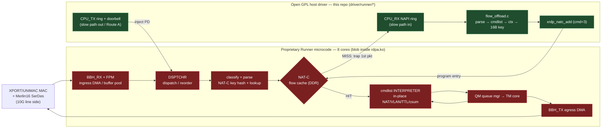

# Audit — BCM4916/BCM6813 XRDP "Runner" open driver

This audit explains, end to end, **how hardware packet acceleration works on the
ASUS GT-BE98 (BCM4916 host SoC / BCM6813 XRDP silicon) and whether the open
driver in `driver/runner/*` can reimplement it.** Top-line answer: acceleration
is the chip's *native* mode, not an add-on. A frame is DMA'd off the MAC into a
DDR buffer, classified by 8 microcoded Runner cores, and looked up in **NAT-C**, a
DDR-backed flow cache keyed by a 16-byte masked big-endian key. On a **HIT** the
Runner runs the flow's **cmdlist** (a per-flow byte-code micro-program doing
NAT/VLAN/TTL/checksum edits in place), enqueues to **QM**, and a **TM** core drains
it to **BBH_TX** and out the egress MAC — the A53 CPU is never touched. On a
**MISS** the first packet traps to Linux, and the open driver compiles a
cmdlist + FC_UCAST context + key and installs a NAT-C entry so every later packet
HITs. **The host owns everything up to the NAT-C entry; the proprietary Runner
microcode owns everything that runs from it.** That line is reimplementable —
the control plane compiles and is QEMU-proven — but *not yet shippable or
silicon-proven*: two clean-room ABI gaps (the real FC_UCAST bitfield + NAT-C
indirect-register interface, and the XPE cmdlist `.text`/`.data` relocation model)
that QEMU cannot expose, plus two mandatory non-redistributable blobs (the Runner
microcode and the Merlin16 SerDes PMD image), stand between here and a working
10G accelerated datapath. The realistic model is *open host driver + microcode the
user extracts from their own `rdpa.ko`* — a Wi-Fi-dongle-firmware shape, not a wall.

## Architecture at a glance

The **red** blocks execute inside the proprietary microcode (per-packet datapath);
the **green** blocks are the open host driver (flow learning + table programming +
slow-path rings). The MAC/SerDes line side has a parallel open-driver-around-a-blob
boundary (open PCS driver, proprietary Merlin16 PMD image).

## Contents & reading order

Read **09 first for the concept**, then the subsystem docs for detail, then
**10 for the forward plan**. 07/08 are references to dip into as needed.

| # | Doc | One-line description | Order |
|---|---|---|---|
| 09 | `09-hardware-acceleration.md` | **The payoff doc.** End-to-end model of the accelerated path + the exact open-host / proprietary-microcode line; §6 = proven-vs-assumed. | **1 (start)** |
| 01 | `01-runner-datapath.md` | Open CPU slow-path / DSA-conduit netdev: moves trapped & CPU-forwarded frames MAC↔CPU over the Runner CPU_RX/CPU_TX rings (the base). | 2 |
| 02 | `02-flow-offload.md` | Flow-offload control plane (HW-accel host side): per-flow parse → cmdlist → FC_UCAST context → 16B NAT-C key → `xrdp_natc_add`. | 3 |
| 03 | `03-cmdlist.md` | The XPE per-flow packet-modification micro-program builder — clean-room re-impl of the stock cmdlist byte-code emitter. | 4 |
| 04 | `04-pcs-serdes.md` | XPORT 10G PCS / Merlin16 "Shortfin" SerDes phylink driver bringing the 10G line side to lock (needs the PMD blob). | 5 |
| 05 | `05-firmware.md` | The two mandatory proprietary blobs (Runner microcode + Merlin16 SerDes PMD), how they are `request_firmware`'d, and the licensing reality. | 6 |
| 06 | `06-stock-re-oracle.md` | `tools/stock-watch` RE oracle: read-only modules/scripts (NAT-C dump, XRDP peek, rdpa kprobe trace) that pin silicon values off the live stock stack. | 7 |
| 07 | `07-qemu-model.md` | The QEMU BCM4916 emulator (SF2 control plane + Runner datapath + NAT-C + Route A) that exercises the driver with no silicon. | ref |
| 08 | `08-hw-abi-regmap.md` | The complete HW address-map / register-ABI reference: every XRDP block base + offset and the bring-up ordering. | ref |
| 10 | `10-reimplementation-guide.md` | **The roadmap.** Ordered, testable milestones (M0–M6) from the current tree to full 10G HW accel, with each ABI gap / blob drawn explicitly. | **last** |

There is no separate findings doc: each subsystem doc ends with an "Audit
findings" section, and `09` §6 ("proven vs assumed") synthesizes them.

## Start here

New to the code? Read **`09-hardware-acceleration.md`** top to bottom — its
one-paragraph model, the block table (§1), the fast/slow path trace (§2), and
especially **§4 (the open/proprietary line)** and **§6 (proven vs assumed)** give
you the whole mental model. Then skim **`10-reimplementation-guide.md` §1**
(works / scaffolded / missing) to see exactly where the code stands today, and
keep `08-hw-abi-regmap.md` open as the register reference while reading the
subsystem docs.
